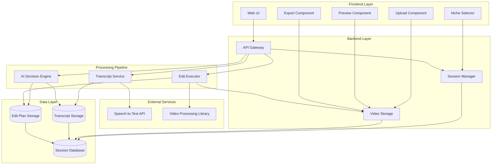

# Design: EDORA - Niche-Aware AI Video Editing Agent

## Overview

EDORA is a transcript-first video editing system that automates post-production based on audience niche. The architecture separates AI decision-making from tool execution, enabling scalable editing workflows through a linear pipeline: upload → transcription → niche selection → AI analysis → execution → export.

## Architecture

### High-Level System Architecture



### Architecture Principles

- **Separation of Concerns**: AI decisions are independent from execution tools
- **Transcript-First**: All editing decisions derive from transcript analysis
- **Stateless Processing**: Each pipeline stage can be retried independently
- **Linear Workflow**: Single clear path from upload to export
- **Niche-Driven**: All AI decisions parameterized by audience niche
- **Modular Components**: Independent development, testing, and scaling

## Components and Interfaces

### Frontend Components

#### Web UI (React SPA)

Renders the linear workflow interface and manages client-side state.

**Key Screens:**
- Upload: Drag-and-drop with format validation
- Processing: Transcript generation progress
- Niche Selection: Four niche cards with descriptions
- Analysis: AI processing status
- Preview: Video preview with edit summary
- Export: Download and completion

**Interface:**
```typescript
interface WebUI {
  // Navigation
  navigateToScreen(screen: ScreenType): void
  
  // Upload handling
  handleVideoUpload(file: File): Promise<UploadResult>
  validateVideoFormat(file: File): ValidationResult
  
  // Status display
  displayProgress(stage: WorkflowStage, progress: number): void
  displayError(error: ErrorInfo): void
  
  // User actions
  onNicheSelected(niche: NicheType): void
  onExportRequested(): void
}

type ScreenType = 'upload' | 'processing' | 'niche' | 'analysis' | 'preview' | 'export'
type WorkflowStage = 'uploading' | 'transcribing' | 'analyzing' | 'editing' | 'exporting'
type NicheType = 'student' | 'creator' | 'educator' | 'bharat'
```

#### 2. Upload Component

Handles file selection, validation, and upload with progress tracking.

**Interface:**
```typescript
interface UploadComponent {
  acceptedFormats: string[] // ['mp4', 'mov', 'avi', 'mkv']
  maxFileSize: number // 2GB in bytes
  
  onFileSelected(file: File): void
  validateFile(file: File): ValidationResult
  uploadFile(file: File): Promise<UploadResult>
  cancelUpload(): void
}

interface ValidationResult {
  valid: boolean
  error?: string
}

interface UploadResult {
  success: boolean
  sessionId?: string
  videoId?: string
  error?: string
}
```

#### 3. Niche Selector Component

Displays four niche options and handles selection.

**Interface:**
```typescript
interface NicheSelectorComponent {
  niches: NicheOption[]
  selectedNiche: NicheType | null
  
  onNicheClick(niche: NicheType): void
  confirmSelection(): void
}

interface NicheOption {
  type: NicheType
  title: string
  description: string
  editingBehavior: string[]
}
```

#### 4. Preview Component

Displays video preview with edit summary and playback controls.

**Interface:**
```typescript
interface PreviewComponent {
  videoUrl: string
  editSummary: EditSummary
  
  loadVideo(url: string): void
  play(): void
  pause(): void
  seek(timestamp: number): void
}

interface EditSummary {
  originalDuration: number
  finalDuration: number
  cutsApplied: number
  captionsAdded: number
  highlightsIdentified: number
}
```

### Backend Components

#### 5. API Gateway

Routes requests, handles authentication, validates payloads, returns standardized responses.

**Interface:**
```typescript
interface APIGateway {
  // Video upload
  POST /api/sessions/upload(file: VideoFile): SessionResponse
  
  // Transcript operations
  GET /api/sessions/:id/transcript: TranscriptResponse
  POST /api/sessions/:id/transcript/generate: JobResponse
  
  // Niche selection
  POST /api/sessions/:id/niche(niche: NicheType): SessionResponse
  
  // AI analysis
  POST /api/sessions/:id/analyze: JobResponse
  GET /api/sessions/:id/edit-plan: EditPlanResponse
  
  // Edit execution
  POST /api/sessions/:id/execute: JobResponse
  GET /api/sessions/:id/status: StatusResponse
  
  // Export
  GET /api/sessions/:id/download: VideoFile
}
```

#### 6. Session Manager

Creates and manages editing sessions, tracks state, handles expiration (24 hours).

**Interface:**
```typescript
interface SessionManager {
  createSession(videoId: string): Session
  getSession(sessionId: string): Session | null
  updateSessionState(sessionId: string, state: SessionState): void
  deleteSession(sessionId: string): void
  cleanupExpiredSessions(): void
}

interface Session {
  id: string
  videoId: string
  state: SessionState
  niche: NicheType | null
  transcriptId: string | null
  editPlanId: string | null
  finalVideoId: string | null
  createdAt: Date
  expiresAt: Date
}

type SessionState = 
  | 'uploaded'
  | 'transcribing'
  | 'awaiting_niche'
  | 'analyzing'
  | 'editing'
  | 'completed'
  | 'failed'
```

#### 7. Video Storage

Stores raw and processed videos, generates signed URLs, handles cleanup.

**Interface:**
```typescript
interface VideoStorage {
  uploadVideo(file: VideoFile, sessionId: string): Promise<string>
  getVideoUrl(videoId: string): Promise<string>
  getVideoMetadata(videoId: string): VideoMetadata
  deleteVideo(videoId: string): Promise<void>
}

interface VideoMetadata {
  id: string
  format: string
  duration: number
  resolution: { width: number; height: number }
  fileSize: number
  uploadedAt: Date
}
```

### Processing Pipeline Components

#### 8. Transcript Service

Extracts audio, calls speech-to-text API, generates timestamped transcripts.

**Interface:**
```typescript
interface TranscriptService {
  generateTranscript(videoId: string): Promise<Transcript>
  getTranscript(transcriptId: string): Transcript | null
  validateTranscript(transcript: Transcript): boolean
}

interface Transcript {
  id: string
  videoId: string
  words: TranscriptWord[]
  duration: number
  language: string
  generatedAt: Date
}

interface TranscriptWord {
  text: string
  startTime: number // milliseconds
  endTime: number // milliseconds
  confidence: number // 0-1
}
```

#### 9. AI Decision Engine

Analyzes transcripts, detects highlights and filler, determines pacing and segments, generates edit plans.

**Interface:**
```typescript
interface AIDecisionEngine {
  analyzeTranscript(transcriptId: string, niche: NicheType): Promise<EditPlan>
  detectHighlights(transcript: Transcript, niche: NicheType): Highlight[]
  detectFillerContent(transcript: Transcript, niche: NicheType): FillerSegment[]
  determineSegments(transcript: Transcript, niche: NicheType): Segment[]
  determinePacing(segments: Segment[], niche: NicheType): PacingDecision[]
  generateCaptions(transcript: Transcript, niche: NicheType): Caption[]
}

interface EditPlan {
  id: string
  sessionId: string
  transcriptId: string
  niche: NicheType
  cuts: Cut[]
  segments: Segment[]
  highlights: Highlight[]
  captions: Caption[]
  pacingDecisions: PacingDecision[]
  estimatedDuration: number
  createdAt: Date
}

interface Cut {
  startTime: number // milliseconds
  endTime: number // milliseconds
  reason: 'filler' | 'silence' | 'repetition'
}

interface Segment {
  id: string
  startTime: number
  endTime: number
  label: string
  isHighlight: boolean
  targetDuration: number
}

interface Highlight {
  segmentId: string
  startTime: number
  endTime: number
  importance: number // 0-1
  reason: string
}

interface Caption {
  text: string
  startTime: number
  endTime: number
  style: CaptionStyle
}

interface CaptionStyle {
  fontSize: number
  fontWeight: 'normal' | 'bold'
  color: string
  backgroundColor: string
  position: 'bottom' | 'top' | 'center'
}

interface PacingDecision {
  segmentId: string
  targetDuration: number
  speedMultiplier: number // 1.0 = normal speed
}

interface FillerSegment {
  startTime: number
  endTime: number
  type: 'um' | 'uh' | 'like' | 'silence' | 'repetition'
}
```

#### 10. Edit Executor

Applies cuts and captions, adjusts pacing, exports final video in MP4 format.

**Interface:**
```typescript
interface EditExecutor {
  executeEditPlan(editPlanId: string, videoId: string): Promise<string>
  applyCuts(video: Video, cuts: Cut[]): Video
  addCaptions(video: Video, captions: Caption[]): Video
  adjustPacing(video: Video, decisions: PacingDecision[]): Video
  exportVideo(video: Video, format: 'mp4'): Promise<string>
}

interface Video {
  id: string
  filePath: string
  duration: number
  resolution: { width: number; height: number }
  frameRate: number
}
```

### Niche Configuration

Each niche has specific parameters that control AI decision-making:

```typescript
interface NicheConfig {
  type: NicheType
  
  // Highlight detection
  highlightCriteria: {
    priorityKeywords: string[]
    minSegmentLength: number // seconds
    maxSegmentLength: number // seconds
    hookWindowStart: number // seconds from start
    hookWindowEnd: number // seconds from start
  }
  
  // Filler removal
  fillerRemoval: {
    maxSilenceDuration: number // seconds
    removeFillerWords: boolean
    aggressiveness: 'low' | 'medium' | 'high'
  }
  
  // Pacing
  pacing: {
    targetSegmentDuration: { min: number; max: number } // seconds
    allowSpeedAdjustment: boolean
    preferredCutStyle: 'smooth' | 'fast' | 'natural'
  }
  
  // Captions
  captionStyle: {
    fontSize: number
    fontWeight: 'normal' | 'bold'
    color: string
    backgroundColor: string
    position: 'bottom' | 'top' | 'center'
    wordsPerCaption: number
    minDisplayDuration: number // milliseconds
  }
}
```

**Niche-Specific Configurations:**

```typescript
const NICHE_CONFIGS: Record<NicheType, NicheConfig> = {
  student: {
    type: 'student',
    highlightCriteria: {
      priorityKeywords: ['definition', 'means', 'example', 'important', 'key concept'],
      minSegmentLength: 10,
      maxSegmentLength: 30,
      hookWindowStart: 0,
      hookWindowEnd: 60
    },
    fillerRemoval: {
      maxSilenceDuration: 2.0,
      removeFillerWords: true,
      aggressiveness: 'medium'
    },
    pacing: {
      targetSegmentDuration: { min: 15, max: 30 },
      allowSpeedAdjustment: false,
      preferredCutStyle: 'smooth'
    },
    captionStyle: {
      fontSize: 24,
      fontWeight: 'normal',
      color: '#FFFFFF',
      backgroundColor: '#000000',
      position: 'bottom',
      wordsPerCaption: 8,
      minDisplayDuration: 2000
    }
  },
  
  creator: {
    type: 'creator',
    highlightCriteria: {
      priorityKeywords: ['amazing', 'incredible', 'check this out', 'watch', 'look'],
      minSegmentLength: 2,
      maxSegmentLength: 8,
      hookWindowStart: 0,
      hookWindowEnd: 30
    },
    fillerRemoval: {
      maxSilenceDuration: 1.0,
      removeFillerWords: true,
      aggressiveness: 'high'
    },
    pacing: {
      targetSegmentDuration: { min: 3, max: 8 },
      allowSpeedAdjustment: true,
      preferredCutStyle: 'fast'
    },
    captionStyle: {
      fontSize: 32,
      fontWeight: 'bold',
      color: '#FFFF00',
      backgroundColor: '#000000',
      position: 'center',
      wordsPerCaption: 3,
      minDisplayDuration: 800
    }
  },
  
  educator: {
    type: 'educator',
    highlightCriteria: {
      priorityKeywords: ['therefore', 'because', 'this shows', 'we can see', 'conclusion'],
      minSegmentLength: 20,
      maxSegmentLength: 60,
      hookWindowStart: 0,
      hookWindowEnd: 120
    },
    fillerRemoval: {
      maxSilenceDuration: 3.0,
      removeFillerWords: false,
      aggressiveness: 'low'
    },
    pacing: {
      targetSegmentDuration: { min: 30, max: 60 },
      allowSpeedAdjustment: false,
      preferredCutStyle: 'natural'
    },
    captionStyle: {
      fontSize: 22,
      fontWeight: 'normal',
      color: '#FFFFFF',
      backgroundColor: '#000000',
      position: 'bottom',
      wordsPerCaption: 12,
      minDisplayDuration: 3000
    }
  },
  
  bharat: {
    type: 'bharat',
    highlightCriteria: {
      priorityKeywords: ['simple', 'easy', 'clear', 'understand', 'basic'],
      minSegmentLength: 8,
      maxSegmentLength: 20,
      hookWindowStart: 0,
      hookWindowEnd: 45
    },
    fillerRemoval: {
      maxSilenceDuration: 2.0,
      removeFillerWords: true,
      aggressiveness: 'medium'
    },
    pacing: {
      targetSegmentDuration: { min: 10, max: 20 },
      allowSpeedAdjustment: false,
      preferredCutStyle: 'smooth'
    },
    captionStyle: {
      fontSize: 28,
      fontWeight: 'bold',
      color: '#FFFFFF',
      backgroundColor: '#000000',
      position: 'bottom',
      wordsPerCaption: 6,
      minDisplayDuration: 2500
    }
  }
}
```

## Data Models

### Session Data Model

```typescript
interface SessionData {
  // Identity
  id: string
  userId: string | null // null for anonymous sessions
  
  // State
  state: SessionState
  currentStage: WorkflowStage
  
  // Video references
  rawVideoId: string
  finalVideoId: string | null
  
  // Processing artifacts
  transcriptId: string | null
  editPlanId: string | null
  
  // User selections
  selectedNiche: NicheType | null
  
  // Metadata
  createdAt: Date
  updatedAt: Date
  expiresAt: Date
  
  // Error tracking
  errors: ErrorLog[]
}

interface ErrorLog {
  timestamp: Date
  stage: WorkflowStage
  errorCode: string
  message: string
  details: any
}
```

### Transcript Data Model

```typescript
interface TranscriptData {
  // Identity
  id: string
  sessionId: string
  videoId: string
  
  // Content
  words: TranscriptWord[]
  fullText: string
  
  // Metadata
  language: string
  duration: number
  wordCount: number
  confidence: number // average confidence
  
  // Timestamps
  generatedAt: Date
  
  // Source
  provider: string // e.g., 'google-speech', 'whisper'
}
```

### Edit Plan Data Model

```typescript
interface EditPlanData {
  // Identity
  id: string
  sessionId: string
  transcriptId: string
  
  // Configuration
  niche: NicheType
  nicheConfig: NicheConfig
  
  // Decisions
  cuts: Cut[]
  segments: Segment[]
  highlights: Highlight[]
  captions: Caption[]
  pacingDecisions: PacingDecision[]
  
  // Metrics
  originalDuration: number
  estimatedFinalDuration: number
  cutsCount: number
  captionsCount: number
  highlightsCount: number
  
  // Timestamps
  createdAt: Date
  
  // Validation
  validated: boolean
  validationErrors: string[]
}
```

### Video Metadata Model

```typescript
interface VideoMetadataData {
  // Identity
  id: string
  sessionId: string
  type: 'raw' | 'final'
  
  // File info
  fileName: string
  filePath: string
  fileSize: number
  format: string
  
  // Video properties
  duration: number
  resolution: {
    width: number
    height: number
  }
  frameRate: number
  bitrate: number
  codec: string
  
  // Audio properties
  audioCodec: string
  audioChannels: number
  audioSampleRate: number
  
  // Timestamps
  uploadedAt: Date
  processedAt: Date | null
  
  // Storage
  storageUrl: string
  downloadUrl: string | null
}
```

## Correctness Properties

*A property is a characteristic that should hold true across all valid executions—a formal statement about system behavior that can be verified through testing.*

### Property 1: Transcript Timestamp Accuracy
*For any* video with speech content, all generated transcript word timestamps SHALL be accurate to within 100ms of actual speech timing.
**Validates: Requirements 2.2**

### Property 2: Niche-Specific Highlight Detection
*For any* transcript and selected niche, all identified highlights SHALL match the niche's priority criteria (keywords, segment length, hook window).
**Validates: Requirements 4.2, 4.3, 4.4, 4.5**

### Property 3: Filler Removal Consistency
*For any* transcript and niche configuration, all silence segments exceeding the niche's threshold SHALL be marked for removal.
**Validates: Requirements 5.2, 5.3, 5.4, 5.5**

### Property 4: Pacing Conformance
*For any* edit plan and niche, all segment durations SHALL fall within the niche's target pacing range.
**Validates: Requirements 6.2, 6.3, 6.4, 6.5**

### Property 5: Caption Synchronization
*For any* generated caption, the timestamp SHALL align with the source transcript word timing within 100ms.
**Validates: Requirements 8.2**

### Property 6: Edit Plan Timestamp Validity
*For any* edit plan, all timestamps (cuts, captions, highlights) SHALL be within the video duration bounds.
**Validates: Requirements 9.3**

### Property 7: Video Quality Preservation
*For any* video processing operation, the output resolution and frame rate SHALL match the input unless explicitly configured otherwise.
**Validates: Requirements 10.3, 11.4**

### Property 8: Session State Consistency
*For any* session, the state transitions SHALL follow the defined workflow order: uploaded → transcribing → awaiting_niche → analyzing → editing → completed.
**Validates: Requirements 12.3**

## Error Handling

- Upload validation: Format and size checks before processing
- Transcription failures: Retry mechanism with user notification
- AI analysis errors: Fallback to default niche behavior
- Edit execution failures: Preserve original video, allow retry
- Session expiration: 24-hour cleanup with user warning
- All errors logged with context for debugging

## Testing Strategy

**Dual Testing Approach:**
- **Unit Tests**: Specific examples, edge cases, error conditions
- **Property Tests**: Universal properties across randomized inputs (minimum 100 iterations)

**Property Test Configuration:**
- Use property-based testing library for target language
- Tag format: **Feature: edora-video-editing-agent, Property {N}: {property_text}**
- Each correctness property implemented as single property-based test

**Coverage:**
- Component integration tests for pipeline stages
- End-to-end workflow tests for complete user journeys
- Performance tests for processing time requirements
- Error handling tests for all failure scenarios
```

